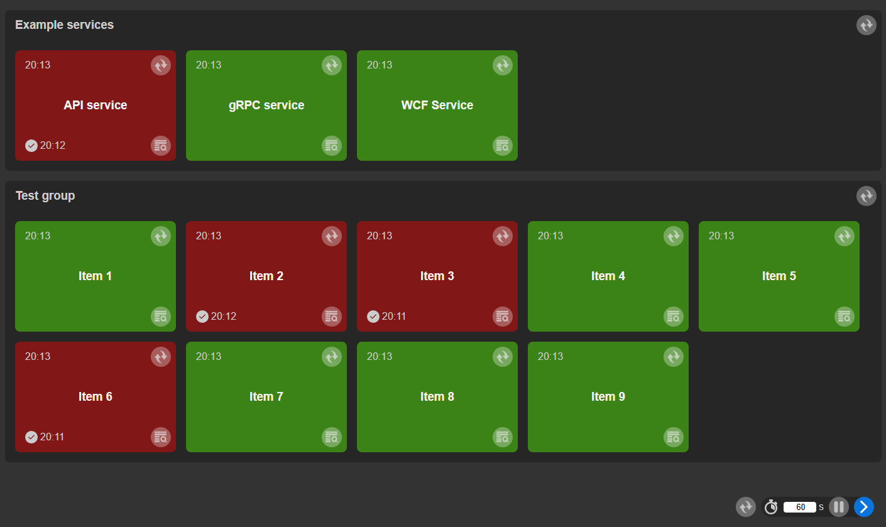

# HealthChecker

Example of health monitoring different service types (REST API, gRPC, WCF).

## Test services
#### REST API (*Example.Api*, default url https://localhost:7001)
- health check: */hc*
- test data: */api/TestData*
- swagger: */swagger*

Health check configured in *Program.cs*

    builder.Services.AddHealthChecks();
    ...
    app.MapHealthChecks("/hc");

#### gRPC (*Example.Grpc*, default url https://localhost:8001)
- test data: contract *ITestDataService*

Health check configured in *Program.cs*

    builder.Services.AddGrpcHealthChecks()
            .AddCheck("Sample", () => HealthCheckResult.Healthy());
    ...
    app.MapGrpcHealthChecksService();

#### WCF (*Example.Wcf*, default url net.tcp://localhost:9001)
- health check: */TestService/hc* (contract *IWcfHealthCheck*)
- test data: */TestService* (contract *ITestDataService*)

Health check configured in *Program.cs* as extra endpoint with *IWcfHealthCheck* contract
    
    host.AddServiceEndpoint(typeof(IWcfHealthCheck), binding, "hc");

*IWcfHealthCheck* is implemented in *TestDataService.cs*

    public bool HealthCheck() => true;

Each service exposes HealthCheck and an example interface with a string returning method (*ITestDataService.GetData*).

When starting the service, you can specify the port on which it will be launched:

`dotnet run --port 7011`

## Test client
*Client.Console* is console application that shows how to communicate with different services (health check and data retrieval using the *GetData* method).

## Health Dashboard
*HealthDashboard.WebApp* (default url https://localhost:5001) 
Blazor Server application visualizing state of monitored services. Also contains a mechanism for periodic health checking and remembering the last results.

#### Configuration
The configuration of the monitored services is set in the *wwwroot/data/items.json* file. Elements can be combined into groups. Each element and group must have a unique *name*.

    [
      {
        "Name": "example_group",
        "Label": "Example services",
        "Order": 1,
        "Items": [
          {
            "Name": "example_api1",
            "Label": "API service",
            "Type": 1,
            "Address": "https://localhost:7001/hc"
          },
          {
            "Name": "example_grpc1",
            "Label": "gRPC service",
            "Type": 2,
            "Address": "https://localhost:8001"
          }
        ]
      }
    ]

#### Services

- *HealthService*

  The main goal (method *CheckHealthAsync*) is to call proper health check and notify the component about the results. 
  Flags *_useRandomResult* and *_useRandomDelay* can be used for demo purpose.

- *ApiHealthService*, *GrpcHealthService*, *WcfHealthService*

  HealthCheck implementations for different service types.

- *HistoryService*

  Responsible for accessing (reading/writing) health checks history.

- *IntervalService*
  
  Responsible for cyclic calling health checks. Allows to enable/disable cyclic polling and change its frequency.

- *ItemService*

  Methods for reading information required by *Item* components.

- *EventBus*

  A simple event bus that provides communication between application components and services.

#### Components

- *Index.razor* (*Pages*)

  The main page of the application.

- *GroupView.razor*

  A container that groups *Items*.

- *ItemView.razor*

  Visualization of the monitored service's state.

- *HistoryView.razor*
  
  A list of the monitored service's availability logs.

- *SettingsView.razor*
  
  Settings for cyclic availability checks.